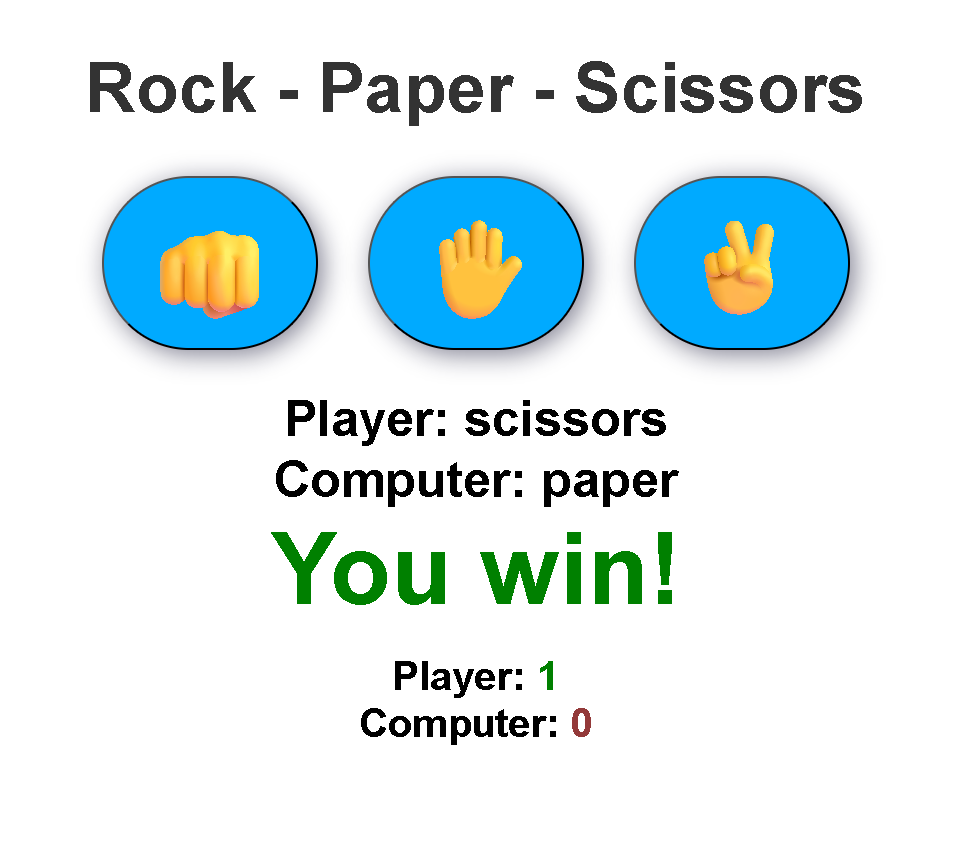

# 🎮 Rock Paper Scissors Game

A simple and interactive **Rock Paper Scissors** game built using **HTML, CSS, and JavaScript**.

The player competes against the computer, and the score updates automatically after every round.

---

## 🚀 Live Features

✅ Play Rock, Paper, Scissors against the computer  
✅ Random computer choice generation  
✅ Real-time result display  
✅ Score tracking system  
✅ Responsive and clean UI  
✅ Hover effects and modern styling  

---

## 🛠️ Technologies Used

- HTML5
- CSS3
- JavaScript (Vanilla JS)

---

## 📸 Preview

---

## 📂 Project Structure

Rock-Paper-Scissors/
│
├── index.html
├── style.css
├── index.js
└── README.md

## 🚀 Live Demo

[Play Game Here](https://mohdhi5253.github.io/rock-paper-scissors/)

## 📱 Responsive Design

The project is optimized for:

Desktop 💻
Tablet 📱
Mobile Devices 📲

## 🙌 Author

Made with ❤️ by Mohammad Dhilawala

## ⭐ Support

If you like this project, give it a ⭐ on GitHub!
